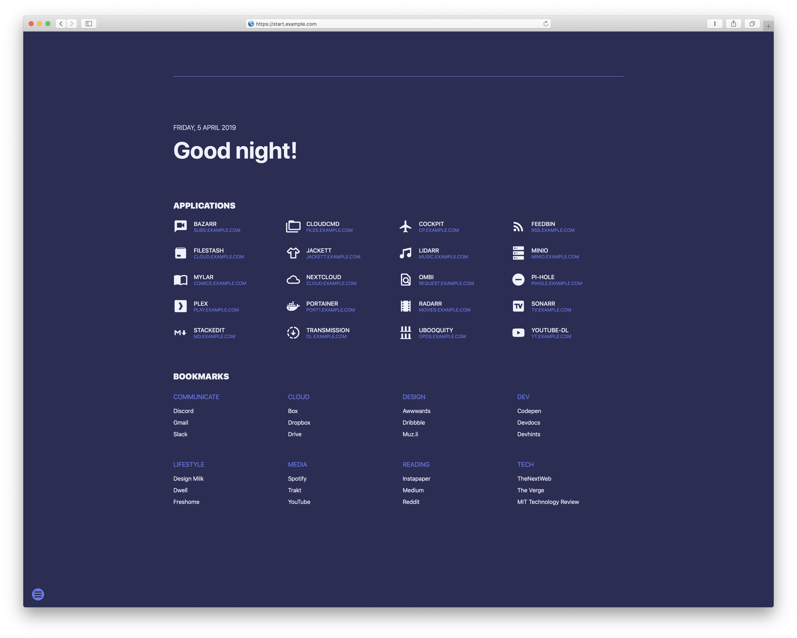

# suigo

_A startpage for your server with docker integration_

This project exists thanks to [SUI](https://github.com/dominicrico/sui-extended)



## Features

- Bookmarks loaded from `json`

- List of applications retrieved from `docker.sock`

- Server/Client side settings

- Customization of design + background image

- Low resource consumption compared to analogues

## Deploy

### docker-compose

```yml
services:
  suigo:
    image: ghcr.io/muratovas/suigo
    container_name: suigo
    restart: unless-stopped
    ports:
      - 8080:8080
    volumes:
      # - ./suigo:/app/config:ro
      - /var/run/docker.sock:/var/run/docker.sock:ro

# code below example
  nginx1:
    image: nginx
    labels:
      - suigo.group=System
      - suigo.name=Nginx
      - suigo.icon=cib-nginx
      # - suigo.href=
      - suigo.description=Web server and a reverse proxy server

  nginx2:
    image: nginx
    labels:
      - suigo.group=Administrator
      - suigo.name=Syncthing
      - suigo.icon=arcticons-syncthing
      - suigo.href=https://syncthing.home.local
      - suigo.description=Peer-to-peer file synchronization  

  nginx3:
    image: nginx
    labels:
      - suigo.group=Administrator
      - suigo.name=Prometheus
      - suigo.icon=cbi-prometheusio
      - suigo.href=https://prometheus.home.local
      - suigo.description=Event monitoring and alerting
```

### docker

```bash
docker build . -t suigo
docker run \
    --rm -p 8080:8080 \
    -v /var/run/docker.sock:/var/run/docker.sock:ro \
    -v $PWD/config:/app/config:ro \
    suigo:latest
# OR
docker run \
    --rm -p 8080:8080 \
    -v /var/run/docker.sock:/var/run/docker.sock:ro \
    ghcr.io/muratovas/suigo:latest
```

## Customization

### Config options

Change the config.json to your likings.

| Option                | Default          | Description                         |
| --------------------- | ---------------- | ----------------------------------- |
| `language`            | `en-GB`          | The language code for localization. |
| `greetings.morning`   | `Good Morning`   | Greeting text for the morning.      |
| `greetings.afternoon` | `Good Afternoon` | Greeting text for the afternoon.    |
| `greetings.evening`   | `Good Evening`   | Greeting text for the evening.      |
| `greetings.night`     | `Good Night`     | Greeting text for the night.        |
| `useAppGroup`         | `false`          | Whether to categorize applications. |
| `withApps`            | `true`           | Whether to show applications.       |
| `withLinks`           | `true`           | Whether to show links.              |
| `withSettings`        | `true`           | Whether to show settings.           |
| `labels.Bookmarks`    | `Bookmarks`      | Label text for bookmarks.           |
| `labels.Applications` | `Applications`   | Label text for applications.        |
| `backgroundImage`     | `""`             | URL for the background image.       |
| `defaultTheme`        | `blackboard`     | The default theme to use.           |

### Theme Configuration

Change any theme you want or at a new theme by adding a name and the 3 color values.

| Option             | Default   | Description                      |
| ------------------ | --------- | -------------------------------- |
| `color-background` | `#1a1a1a` | Background color of the theme.   |
| `color-text-pri`   | `#FFFDEA` | Primary text color of the theme. |
| `color-text-acc`   | `#5c5c5c` | Accent text color of the theme.  |

### Changing color themes

To change your theme click the options button on the bottom left and select your new theme. The selected theme will be stored in the local storage and loaded from there.

### Bookmarks

Add your bookmarks by editing the `links.json`:

```json
{
  "Bookmarks" : [
    {
      "Group": "Communicate",
      "Links": [
        {
          "Name": "Discord",
          "Href": "https://discord.com"
        },
        {
          "Name": "Gmail",
          "Href": "http://gmail.com"
        },
        {
          "Name": "Slack",
          "Href": "https://slack.com/signin"
        }
      ]
    }
  ]
}

```

Add names for the categories you wish to define and add the bookmarks for each category.

Please note:

- No `,` at the end of the last bookmark in a category and at the end of the last category

## Changelog:

### v0.0.2
- settings removed
- buttons are displayed as cards
- optimized (less code)

### v0.0.1
- Init